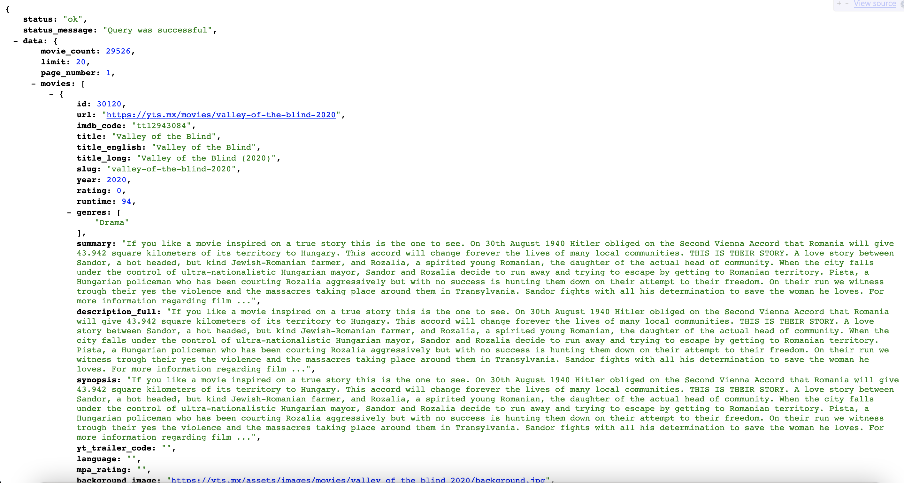
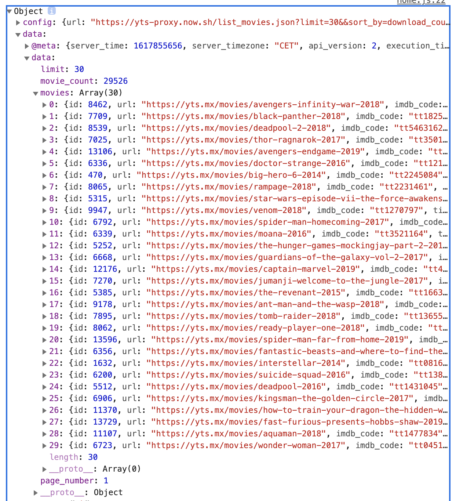

## Movie App 2020

### React JS Fundamental Course 2020 > 2021 리뉴얼

### 둘러보기
https://junh0328.github.io/movie_app__2020/

### 리뉴얼 방향

- 클래스형 컴포넌트를 함수형 컴포넌트로 변경
- 리덕스사가를 통한 비동기처리
- 스토어를 통한 상태관리

> 인피니티 스크롤 기능 추가 여부 파악

> url을 통해 넘겨받는 API를 어떻게 나눠줄 수 있을지

- 타입스크립트 적용

## 적용단계 설명

## 외부 API를 사용하여 리액트로 데이터 표현하기

<b>외부 URL : https://yts.mx/api/v2/list_movies.json</b>

> 필요한 크롬 확장 프로그램: <a href="https://chrome.google.com/webstore/detail/json-viewer/gbmdgpbipfallnflgajpaliibnhdgobh?hl=ko&hc_location=ufi">JSON VIEWR</a>

> 출처: <a href="https://nomadcoders.co/react-fundamentals/lobby"> 니코쌤의 ReactJS로 영화 웹 서비스 만들기 </a>

## 리덕스, 리듀서의 개념을 사용하여 API 불러오기

<p>우리가 불러오고자 하는 오픈 API의 데이터 형식은 다음과 같다.</p>



<br/>

<p>첫 번째로 오픈 데이터 API를 axios 라이브러리르 사용하여 불러올 때 중요한 점은 데이터가 어떤 구조로 들어 있는 지를 확인하는 것이다.</p>

```js
const getMovies = async () => {
    const response = await axios.get('https://yts-proxy.now.sh/list_movies.json?limit=30&&sort_by=download_count');
    console.log(response);
  };
```

<p>해당 api 데이터를 받아 콘솔로그로 찍으면 다음과 같은 결과값을 얻을 수 있다. Object 객체 안에 프로퍼티 형식으로 들어있다.</p>



<p>우리가 접근해야 하는 movies 프로퍼티는 결과적으로 받아오는 data.data.movies 안에 들어있는 배열로 이루어진 객체들이다.</p>

> [0] : {id : 8462 , title, genres, ...}

<p>그에 맞춰 데이터를 불러오기 위해서는 data.data.movies.id, ... 와 같이 불러와야 하므로 구조 분해 할당 문법을 통해 movies 프로퍼티 안에 들어있는 내용을 movies 변수에 담아 가져온다.</p>

```js
   const {data: {data: { movies },},} = await axios.get('https://yts-proxy.now.sh/list_movies.json?limit=30&&sort_by=download_count');
```

<p>구조분해할당을 통해 얻어온 movies 객체를 찍으면 우리가 얻고자 하는 배열 형식의 데이터를 얻을 수 있게된다.</p>

> [0] : {id : 8462 , title: ..., genres: ..., ...}

> [1] : {id : 8463 , title: ..., genres: ..., ...}

> [2] : {id : 8464 , title: ..., genres: ..., ...}

> [3] : {id : 8465 , title: ..., genres: ..., ...}

> [4] : {id : 8466 , title: ..., genres: ..., ...}

<p>이 데이터를 기존 reducer에서 intialState로 관리하는 movies : [] 에 <a href="https://developer.mozilla.org/en-US/search?q=Array.prototype">concat</a> 해주면 리듀서를 사용한 데이터를 받아오는 처리를 할 수 있다.</p>

## 페이지, 리듀서, 리덕스-사가 data flow 

1. 첫 번째로, 화면을 보여주는 view 단에서 useEffect()를 통해 상황을 감지한다. 아무것도 없는 상태일 때, dispatch를 통해 LOAD_MOVIES_REQUEST 액션을 실행한다.

```js
// useEffect에 조건문을 통해 특정한 상황을 정해주지 않았으므로, 해당 어플리케이션이 렌더링될 때 실행시킨다.
useEffect(() => {
    dispatch({
      type: LOAD_MOVIES_REQUEST,
    });
  }, [dispatch]);
```

2. sagas/movies 에서 LOAD_MOVIES_REQUEST 을 감지하는 함수 watchLoadMovies()를 통해 데이터를 불러오는 함수 loadMovies()를 실행한다.

```js
function* watchLoadMovies() {
  yield takeLatest(LOAD_MOVIES_REQUEST, loadMovies);
}

export default function* movieSaga() {
  yield all([fork(watchLoadMovies)]);
}
```

3. loadMovies()를 실행했을 때 실제 작업을 진행하는 loadMoviesAPI()를 실행한 후 결과값을 result에 담는다.

```js
async function loadMoviesAPI() {
  try {
    const {
      data: {
        data: { movies },
      },
    } = await axios.get('https://yts-proxy.now.sh/list_movies.json?limit=10&&sort_by=download_count');
    // 여기서 확인
    console.log(`movies 가져와서 구조분해할당으로 담기`);
    console.log(movies);
    return movies;
  } catch (err) {
    console.error(err);
    return;
  }
}

function* loadMovies() {
  const result = yield call(loadMoviesAPI); // loadMoviesAPI 함수 호출에 의해 return 된 movies 객체
  // 여기서 잘 불러왔는지 확인
  console.log('리턴된 result 출력 :');
  console.log(result);

```

4. 얻어오는 데이터 처리에 따라 LOAD_MOVIES_SUCCESS 또는 LOAD_MOVIES_FAILURE를 발생시키고 그와 함께 data를 전달한다. (에러일 경우 error를 전달)

```js
function* loadMovies() {
  const result = yield call(loadMoviesAPI); // loadMoviesAPI 함수 호출에 의해 return 된 movies 객체
  // 여기서 잘 불러왔는지 확인
  console.log('리턴된 result 출력 :');
  console.log(result);
  try {
    console.log('saga loadMovies start!');
    yield put({
      type: LOAD_MOVIES_SUCCESS,
      data: result,
    });
  } catch (err) {
    console.error(err);
    yield put({
      type: LOAD_MOVIES_FAILURE,
      error: err.response.data,
    });
  }
}
```

5. 리듀서에서 사가에서 전달받은 액션과, 액션에 담긴 데이터를 실행한다.

```js
const movies = (state = initialState, action) =>
  produce(state, (draft) => {
    switch (action.type) {
      case LOAD_MOVIES_REQUEST: {
        draft.loadMovieLoading = true;
        draft.loadMovieDone = false;
        break;
      }
      case LOAD_MOVIES_SUCCESS: {
        draft.movies = draft.movies.concat(action.data);  
        // action.data 에는 사가에서 넘겨준 result 값이 담겨있다.
        draft.isLoading = false;  
        // 데이터를 성공적으로 넘겨받을 시, initialStae에서 관리하는 isLoading을 false 로 바꿔준다. 이 조건을 통해 movies를 매핑할 수 있게 된다.
        draft.loadMovieDone = true;
        break;
      }
      case LOAD_MOVIES_FAILURE: {
        draft.loadMovieError = action.error;
        break;
      }
      default:
        return state;
    }
  });
```

6. virtual DOM이 바뀐 state를 감지하여 리렌더링한다.

```js
return (
    <section className="container">
      {isLoading ? (
        <div>로딩중..</div>
      ) : (
        <div className="movies">
          {movies.map((movie) => (
            <Movie
              key={movie.id}
              id={movie.id}
              year={movie.year}
              title={movie.title}
              summary={movie.summary}
              poster={movie.medium_cover_image}
              genres={movie.genres}
            />
          ))}
        </div>
        // <div>로딩 완료!</div>
      )}
    </section>
  );
```

## 주의할 점

1. redux-saga를 처리하는 과정에서 넘겨받은 결과값을 그대로 전달해야 하는데, 서버에서 받은 것처럼 result.data로 처리하면 리듀서에서 concat 할 때 undefined 가 뜰 수 있다.

```js
function* loadMovies() {
  const result = yield call(loadMoviesAPI); 
  try {
    yield put({
      type: LOAD_MOVIES_SUCCESS,
      data: result, // 여기서 result.data로 쓰지 않도록 주의한다.
    });
  } catch (err) {
    console.error(err);
    yield put({
      type: LOAD_MOVIES_FAILURE,
      error: err.response.data,
    });
  }
}
```

2. redux-saga를 통해 처리하므로 데이터를 받아올 때까지 기다렸다가 다음 작업을 진행할 수 있도록 js의 generator의 개념을 잘 알고 있어야 한다.
> 사가에서 data를 넘겨주지 않고, 액션 타입인 LOAD_MOVIES_SUCCESS만 보내주고 리듀서에서 임의 함수 getMovies()를 처리할 경우 데이터를 제대로 받아오지 못 한 채로 넘겨줄 수 있다.

```js

// getMovies()의 바뀐 형태, 리덕스-사가 처리과정을 거치기 때문에 call() 함수로 loadMoviesAPI()를 실행한 후 리턴받은 movies를 loadMovies() 함수에서 result로 받아줬다.

async function loadMoviesAPI() {
  try {
    const {
      data: {
        data: { movies },
      },
    } = await axios.get('https://yts-proxy.now.sh/list_movies.json?limit=10&&sort_by=download_count');
    // 여기서 확인
    console.log(`movies 가져와서 구조분해할당으로 담기`);
    console.log(movies);
    return movies;
  } catch (err) {
    console.error(err);
    return;
  }
}
```